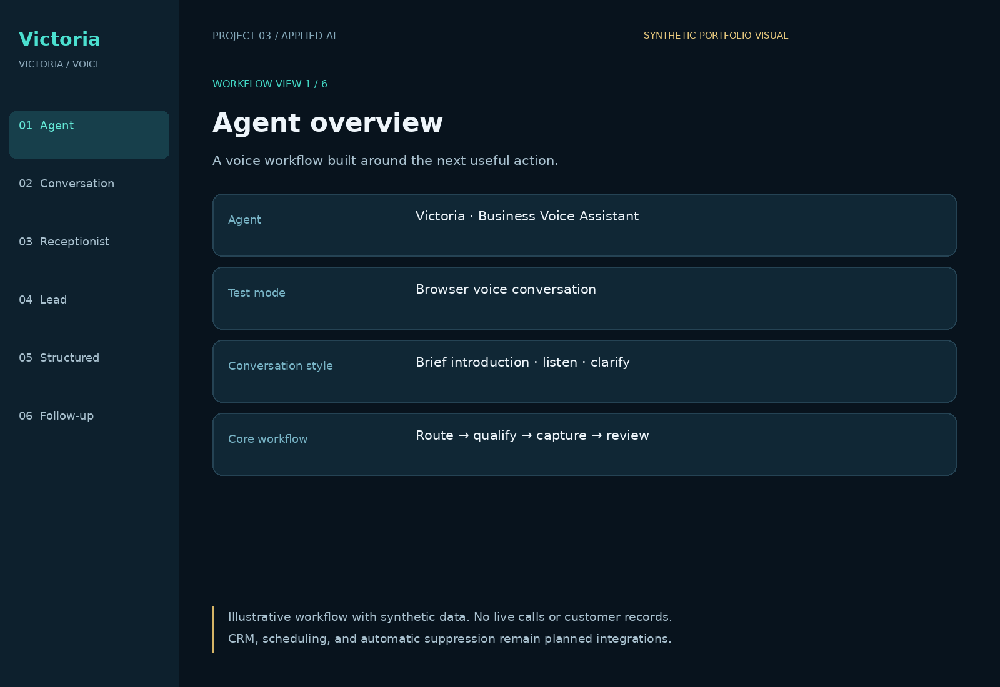
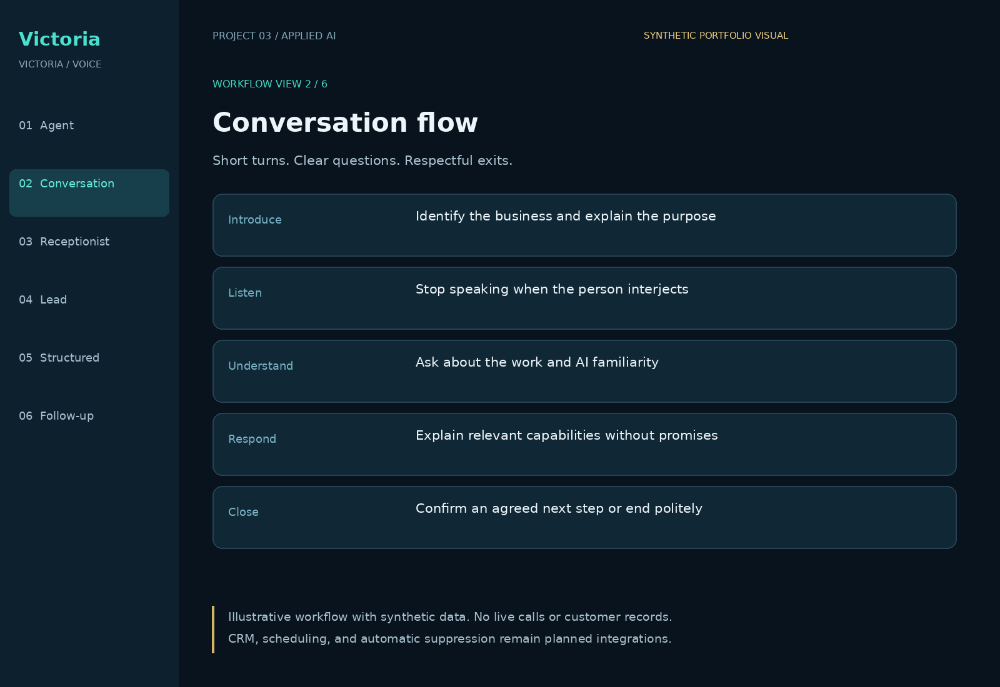
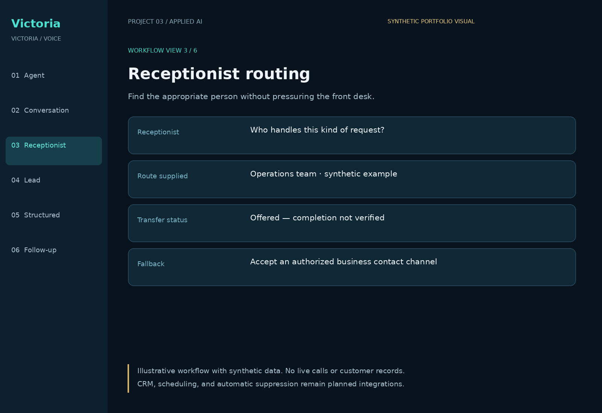
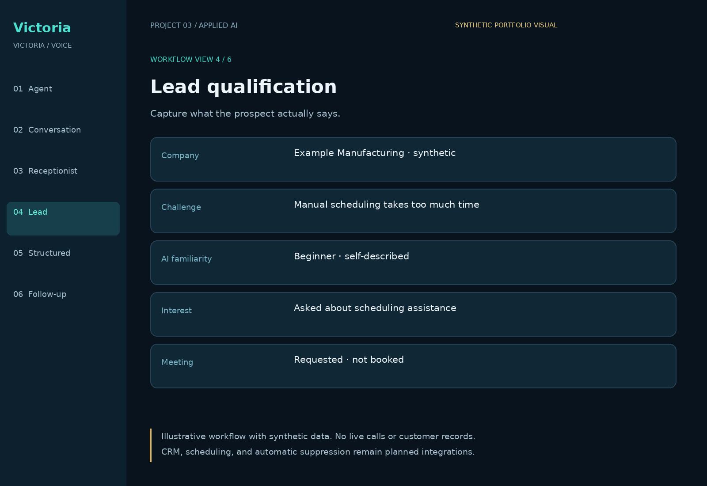
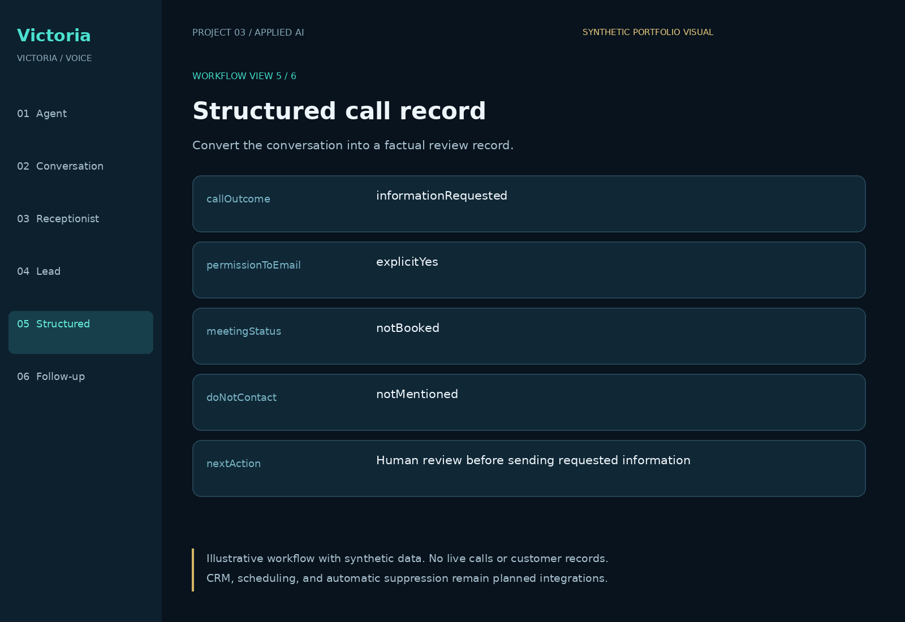
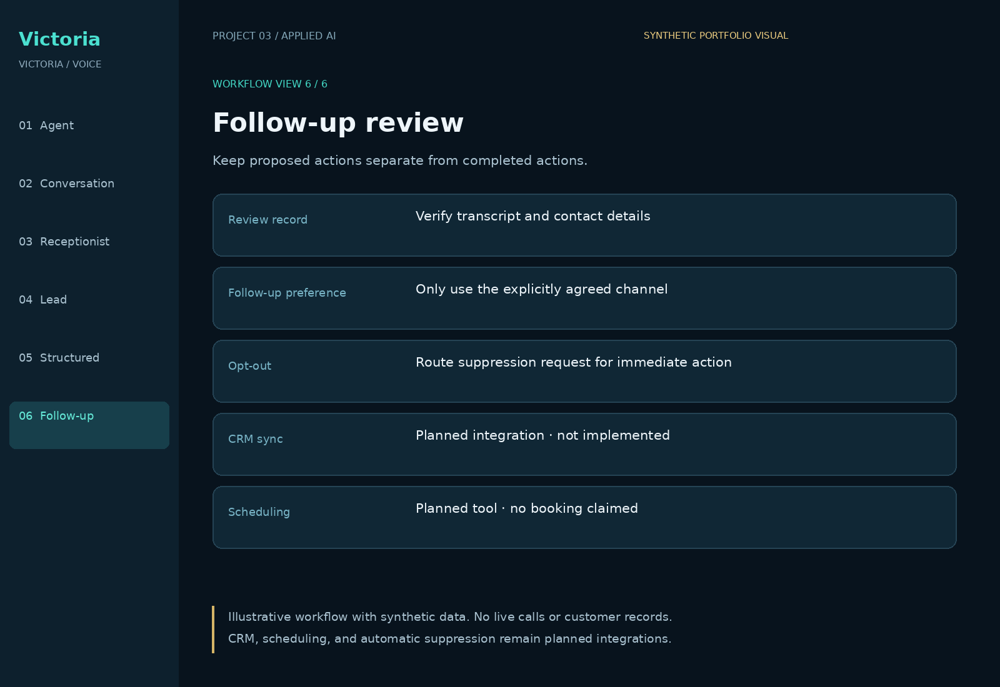
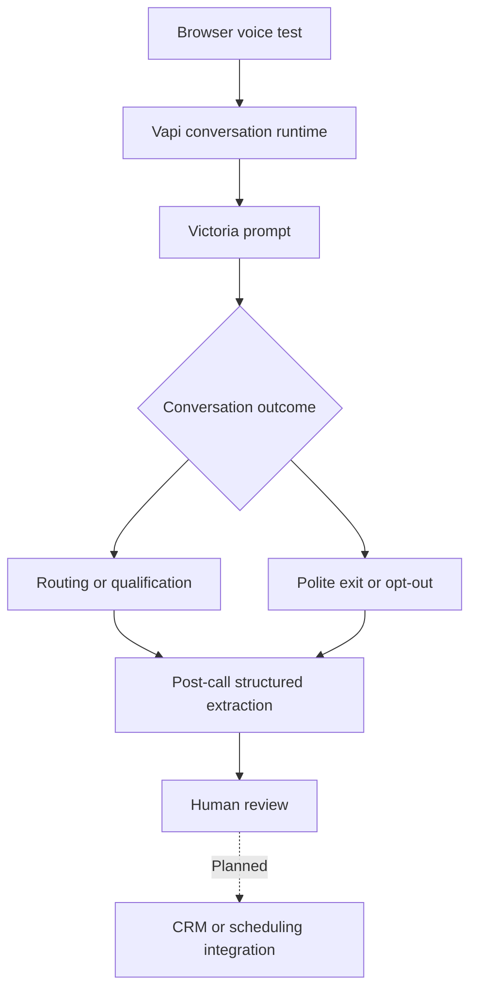

# Voice AI Agent — Victoria — Business Voice Assistant

A portfolio case study of a conversational business assistant that introduces the business, listens to questions, routes through receptionists, qualifies business needs, and structures call information for human review.

**Created by Federico Veneziano · Project #3**

## Business problem
Routine business conversations can consume time while leaving inconsistent notes, unclear follow-up expectations, and missed handoffs. This project explores a repeatable voice workflow with concise conversation and factual records.

## What I designed
- A short introduction followed by questions appropriate to the person's AI familiarity.
- Receptionist routing, interruption handling, and respectful call endings.
- Separation of products presented from products the prospect actually asks about.
- Structured records for outcomes, objections, contact details, and explicit follow-up preferences.
- Human review before downstream action; proposed meetings remain unbooked until a scheduling tool succeeds.

## Implementation status
| Component | Status |
|---|---|
| Vapi browser voice test | Completed in private development; reported by the builder |
| Conversation behavior | Designed; public prompt example included |
| Post-call structured output | Existing private setup documented; public schema included |
| Public portfolio interface | Runnable local demo with synthetic data |
| Telephone campaigns / live transfers | Not demonstrated in this repository |
| CRM sync, scheduling, automatic suppression | Future integrations; not implemented here |

This is a **sanitized case study and configuration starter**, not a production calling service. No performance improvement or conversion rate is claimed. Production credentials, recordings, phone numbers, and customer records are excluded.

## View the demo
Download or clone this repository and open `demo/index.html` in a browser. Select the six workflow views. The interface is illustrative and does not connect to a live voice service.

## Portfolio screenshots
All six are **illustrative workflow visuals rendered from synthetic demo content**, not live application or Vapi dashboard screenshots. The same six views are available in the included HTML demo.

### Agent overview

### Conversation flow

### Receptionist routing

### Lead qualification

### Structured call record

### Follow-up review

## Architecture

## Repository guide
- `prompts/victoria-system-prompt.md`: public conversation prompt.
- `config/call-record.schema.json`: JSON Schema for post-call records.
- `examples/synthetic-call-record.json`: clearly synthetic example.
- `docs/architecture.md`: implementation boundaries and design decisions.
- `docs/test-plan.md`: reproducible test scenarios; no fabricated pass results.
- `docs/setup.md`: manual configuration checklist.
- `docs/case-study.md`: problem, approach, lessons, and measurement plan.

## Skills demonstrated
Applied AI workflow design · conversational UX · prompt engineering · structured information capture · business process design · human review and escalation.
